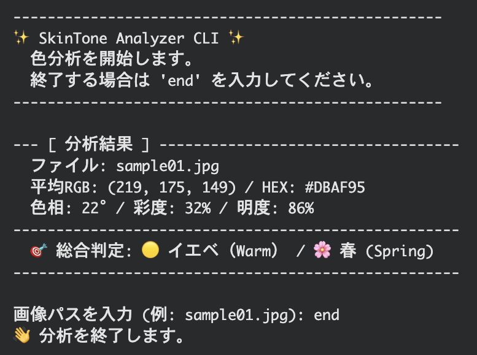

# 🌟 SkinTone Analyzer CLI

**画像から平均色を抽出し、HSB（色相・彩度・明度）分析を通じてパーソナルカラーのトーン（イエベ・ブルベ、四季）を判定するPythonコマンドラインツールです。**

---

## 📸 デモンストレーション

画像からRGB値（219, 175, 149）を抽出し、HSB変換と細分化ロジックを適用したデモ結果です。

---

## 🧐 開発背景
このプロジェクトは、主観的な印象に頼りがちであった美容分野のプロセスを、画像解析と色彩科学の力で客観化するという美容とデジタル技術の架け橋になる試みです。
* **客観的な指標の確立**: 肌の色を単なるRGB値（赤、緑、青）として扱うのではなく、HSB（色相、彩度、明度）色空間に変換することで、人間の知覚に近く、パーソナルカラー診断のコアロジックである「イエローベース（イエベ）」と「ブルーベース（ブルベ）」の判定に不可欠な色相（Hue）を客観的に数値化します。
* **科学的根拠に基づく細分化**: 単にイエベ・ブルベを判定するだけでなく、明度（Brightness）と彩度（Saturation）に明確な閾値を設けることで、春、夏、秋、冬という四季のトーン分類をロジックに基づいて実行します。

---

## 📊 機能一覧
* 平均RGB抽出: Pillow を使用し、画像データ全体から代表的な平均RGB値を正確に計算します。
* HSB変換アルゴリズム: RGB値を HSB/HSV色空間に変換し、イエベ・ブルベ判定のコアとなる**色相（H）**を抽出します。
* 四季トーン分類: 色相に加え、彩度（S）と明度（V）の閾値判定を組み合わせ、春、夏、秋、冬 の四季に細分化します。
* 対話型CLI: os モジュールと while ループにより、ユーザーが画像パスを連続入力できる実用的なコマンドラインインターフェースを提供します。

---

## 🛠️ 技術と環境構築
* 言語: **Python 3.x**
* 実行環境: **Google Colab**
* ライブラリ: **Pillow** (pip install Pillow)

---

## 🚀 使い方
### 1. Drive のマウントとコードの実行
Colabノートブックでコード全体を実行し、main_cli() 関数を起動します。
### 2. ツールの起動とパスの入力
ツールが起動したら、Google Driveの MyDrive フォルダを基点とした相対パスを入力します。

---

## 🔬 ロジック詳細
HSB/HSV色空間における色相 (Hue: $0^\circ \sim 360^\circ$) と明度 (Value/Brightness: $0\% \sim 100\%$) の閾値に基づいています。

### 1. ベースカラー判定（イエベ/ブルベ）
| 判定 | 色相 (H) |
| :--- | :--- |
| イエベ | $10^\circ \le H \le 60^\circ$ |
| ブルベ | $200^\circ \le H \le 280^\circ$ |

### 2. 四季分類の基準
| 季節 | ベース | 明度 (V) | 彩度 (S) | 特徴 |
| :--- | :--- | :--- | :--- | :--- |
| 春 | イエベ | $V \ge 70\%$ | $S \ge 30\%$ | 明るくクリア |
| 夏 | ブルベ | $V \ge 65\%$ | $S < 30\%$ | 明るくソフト |
| 秋 | イエベ | $V < 70\%$ | - | 落ち着いた深み |
| 冬 | ブルベ | $V < 65\%$ | - | 暗く鮮やか |

---

## 📝 ライセンス
本プロジェクトは **MIT License** の下で公開されています。
詳細は [LICENSE](LICENSE) ファイルを参照してください。

----- **English Version** -----
# 🌟 SkinTone Analyzer CLI

**A Python Command Line Interface (CLI) tool that analyzes personal color tone (Warm/Cool, Seasonal) by extracting the average color from an image and applying HSB (Hue, Saturation, Brightness) analysis.**

---

## 📸 Demonstration

This demonstration shows the result after extracting the RGB value (219, 175, 149), performing HSB conversion, and applying the detailed classification logic.

---

## 🧐 Development Background
This project serves as a bridge between the beauty industry and digital technology by using image analysis and color science to objectify processes that have traditionally relied on subjective impressions.

* **Establishing Objective Metrics**: Instead of treating skin color merely as RGB values (Red, Green, Blue), we convert it to the HSB (Hue, Saturation, Brightness) color space. This conversion objectively quantifies Hue, which is indispensable for determining the core logic of personal color diagnosis—Yellow Base (Warm) and Blue Base (Cool)—since it closely aligns with human color perception.
* **Scientific Subdivision**: Beyond simply determining Warm or Cool tones, the tool applies clear thresholds for Brightness (Value) and Saturation to execute the four-season tone classification (Spring, Summer, Autumn, Winter) based on concrete logic.

---

## 📊 Feature List
* **Average RGB Extraction**: Uses the Pillow library to accurately calculate the representative average RGB value from the image data.
* **HSB Conversion Algorithm**: Converts RGB values into the HSB/HSV color space to extract the **Hue (H)**, the core element for Warm/Cool tone determination.
* **Seasonal Tone Classification**: Combines Hue, Saturation (S), and Brightness (V) thresholds to classify tones into **Spring, Summer, Autumn, and Winter**.
* **Interactive CLI**: Provides a practical command-line interface using the `os` module and a `while` loop, allowing users to continuously input image paths.

---

## 🛠️ Technology and Setup

* **Language**: **Python 3.x**
* **Execution Environment**: **Google Colab** (Recommended) / Local PC
* **Library**: **Pillow** (`pip install Pillow`)

---

## 🚀 Usage

### 1. Mount Drive and Run Code
Execute the entire code in your Colab notebook to start the `main_cli()` function.

### 2. Tool Startup and Path Input
When the tool prompts for input, enter the relative path starting from your Google Drive's **`MyDrive`** folder.

---

## 🔬 Detailed Logic

The classification is based on Hue ($0^\circ \sim 360^\circ$) and Brightness/Value ($0\% \sim 100\%$) thresholds in the HSB/HSV color space.

### 1. Base Color Determination (Warm / Cool)

| Determination | Hue Range (H) |
| :--- | :--- |
| **Warm (Yellow-Base)** | $10^\circ \le H \le 60^\circ$ |
| **Cool (Blue-Base)** | $200^\circ \le H \le 280^\circ$ |

### 2. Seasonal Classification Criteria

| Season | Base | Brightness (V) | Saturation (S) | Trait |
| :--- | :--- | :--- | :--- | :--- |
| **Spring** | Warm | $V \ge 70\%$ | $S \ge 30\%$ | Light and Clear |
| **Summer** | Cool | $V \ge 65\%$ | $S < 30\%$ | Light and Soft |
| **Autumn** | Warm | $V < 70\%$ | - | Deep and Muted |
| **Winter** | Cool | $V < 65\%$ | - | Dark and Vivid |

---

## 📝 License

This project is released under the **MIT License**.
See the [LICENSE](LICENSE) file for details.
